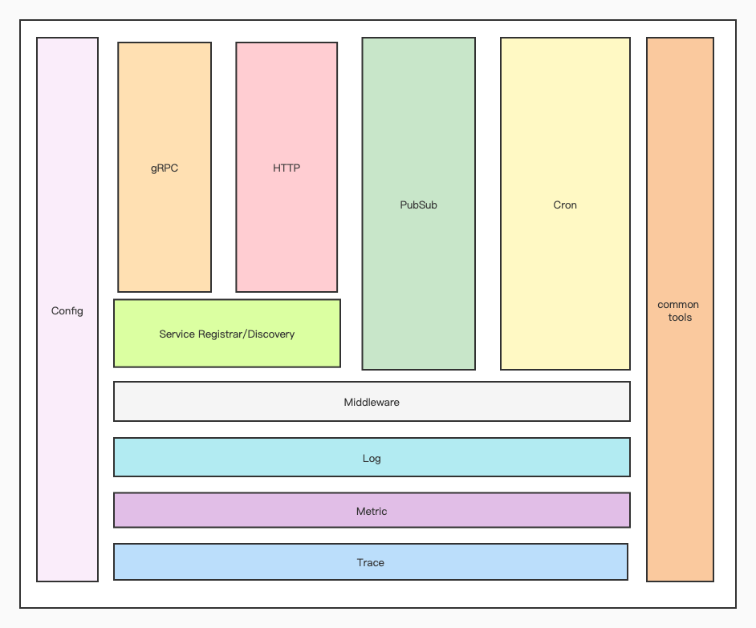

# Leo框架系列（一）开篇介绍与Leo启动分析

# 前言
<a href="https://github.com/go-leo/leo" target="_blank">Leo</a>是一款可以快速构建可直接运行的高性能Go应用程序框架，它提供了很多工具，帮助开发者降低搭建分布式或者微服务系统的复杂度，专注于业务开发。目前已全面应用于七猫免费小说推荐引擎服务中，在这种高要求的场景下也检验了Leo的可靠性。

>Leo这个名字来自于我养的一只叫Leo的猫。

# Leo的特点
1. 支持HTTP服务和gRPC服务，同时支持HTTP代理gRPC服务。
2. 支持Cron定时任务。
3. 支持Pub/Sub任务。
4. 服务注册与发现、限流、熔断、重试等微服务措施。
5. 配置管理。
6. 高扩展性，所有组件基于接口开发，HTTP、gRPC、Cron、Pub/Sub支持中间件扩展。
7. 高性能，所有组件仅简单封装，相当于直接运行原框架。
8. 完善的应用可观测性设计，trace、log、metrics三板斧提高系统可用性。

# Getting Started
## Quick Start
install `protoc-gen-go-leo` plugin
```sh
go install github.com/go-leo/leo/cmd/protoc-gen-go-leo@latest
```
## Example
* <a href="https://github.com/go-leo/example/tree/main/cmd/httpdemo" target="_blank">HTTP Demo</a> HTTP服务示例。
* <a href="https://github.com/go-leo/example/tree/main/cmd/grpcdemo" target="_blank">gRPC Demo</a> gRPC服务示例。
* <a href="https://github.com/go-leo/example/tree/main/cmd/proxydemo" target="_blank">Proxy Demo</a> HTTP反向代理gRPC示例，实现了gRPC-Gateway的功能。
* <a href="https://github.com/go-leo/example/tree/main/cmd/kafkastreamdemo" target="_blank">Event Driven Demo</a> 事件驱动型应用示例。
* <a href="https://github.com/go-leo/example/tree/main/cmd/kafkasubdemo" target="_blank">Subscriber Demo</a> 消息订阅者示例。
* <a href="https://github.com/go-leo/example/tree/main/cmd/kafkapubdemo" target="_blank">Publisher Demo</a> 消息发布者示例。
* <a href="https://github.com/go-leo/example/tree/main/cmd/crondemo" target="_blank">Cron Demo</a> 定时任务示例。
* <a href="https://github.com/go-leo/example/tree/main/cmd/callabledemo" target="_blank">Callable Demo</a> 扩展Leo的方式一示例。
* <a href="https://github.com/go-leo/example/tree/main/cmd/runnabledemo" target="_blank">Runnable Demo</a> 扩展Leo的方式二示例。
* <a href="https://github.com/go-leo/example/tree/main/cmd/configdemo" target="_blank">Config Demo</a> 配置读取示例。
* <a href="https://github.com/go-leo/example/tree/main/cmd/registrydemo" target="_blank">Service Register Demo</a> 服务注册与发现示例。

# Leo的架构


# Leo的启动
这里预先定义一个概念：可以跑在Leo上的代码统称为运行实体。比如HTTP服务、gRPC服务、Cron任务、PubSub任务等。

Leo有两种类型运行实体
- 第一种比较“单纯”，直接运行逻辑，比如进行一个复杂的计算。
- 第二种是除了执行逻辑外，结束时需要有相关操作的，比如优雅关闭服务、关闭资源或者清理垃圾数据等。

### Callable接口
第一种运行实体在Leo里抽象成一个`Callable`接口。
```go
type Callable interface {
	fmt.Stringer
	Invoke(ctx context.Context) error
}
```
下面介绍一个简单的`Callable`，睡眠30秒后退出：
```go
var _ runner.Callable = new(CallDemo)
type CallDemo struct{}
func (c *CallDemo) String() string {
	return "callabledemo"
}
func (c *CallDemo) Invoke(ctx context.Context) error {
	global.Logger().Info("start invoke")
	defer global.Logger().Info("stop invoke")
	global.Logger().Info("will sleep 30s")
	select {
	case <-ctx.Done():
		return ctx.Err()
	case <-time.After(30 * time.Second):
	}
	return nil
}
```
### Runnable接口
第二种运行实体在Leo里抽象成一个`Runnable`接口。
```go
type Runnable interface {
	fmt.Stringer
	Start(ctx context.Context) error
	Stop(ctx context.Context) error
}
```
下面介绍一个简单的`Runnable`。每秒收集cpu的利用率并上报到`io.WriteCloser`中。
```go
var _ runner.Runnable = new(RunnableDemo)
type RunnableDemo struct {
	w     io.WriteCloser
	exitC chan struct{}
}
func NewRunnableDemo(w io.WriteCloser) *RunnableDemo {
	return &RunnableDemo{w: w, exitC: make(chan struct{})}
}
func (h *RunnableDemo) String() string { return "RunnableDemo" }
func (h *RunnableDemo) Start(ctx context.Context) error {
	ticker := time.NewTicker(time.Second)
	for {
		select {
		case <-h.exitC:
			ticker.Stop()
			return nil
		case t := <-ticker.C:
			percent, err := cpu.Percent(time.Second, true)
			if err != nil {
				return err
			}
			text := fmt.Sprintf("%s cpu percent is %f\n", t.String(), percent)
			if _, err := h.w.Write([]byte(text)); err != nil {
				return err
			}
		}
	}
}
func (h *RunnableDemo) Stop(ctx context.Context) error {
	close(h.exitC)
	return h.w.Close()
}
```
- `Start(ctx)`方法首先创建一个1秒的`Ticker`，然后死循环，死循环里有个`select`代码块,监听两个channel的receive。
  - `case <-h.exitC`代码块作用是，当`h.exitC`被关闭时，停止`Ticker`，返回`nil`。
  - `case t := <-h.ticker.C`代码块作用是每秒收集一次CPU利用率，并上报到一个`io.WriteCloser`中
- `Stop(ctx)`调用`close()`函数关闭`h.exitC`，导致`Start(ctx)`会退出，然后关闭`io.WriteCloser`。

在Leo里，`HTTP Server`、`gRPC Server`、`Cron Task`、`PubSub Task`等都实现`Callable`或者`Runnable`接口。实现这两种接口，可以极大的扩展Leo的功能，实现当前Leo框架不支持的功能（比如实现一个`json rpc`服务）。

## 创建Leo应用
Leo可以跑多种多样的运行实体，下面介绍如何创建一个Leo应用。
```go
func newApp() *leo.App {
	return leo.NewApp(
		leo.ID(),
		leo.Name(),
		leo.Version(),
		leo.Metadata(),
		leo.Logger(),
		leo.Service(),
		leo.HTTP(),
		leo.GRPC(),
		leo.Registrar(),
		leo.Cron(),
		leo.PubSub(),
		leo.Runnable(),
		leo.Callable(),
		leo.Management(),
		leo.ShutdownSignal(),
		leo.RestartSignal(),
	)
}
```
创建应用需要调用`leo.NewApp(opts ...Option)`方法来创建，Leo提供了很多`Option`：
- `leo.ID()` 应用ID，在一个集群中是不可以重复的。如果不设置这个Option，那么会从`LEO_SERVICE_ID`环境变量获取，还没有则Leo自己生成一个UUID。
- `leo.Name()` 应用名，在一个集群中可以重复。如果不设置这个Option，那么会从`LEO_SERVICE_NAME`环境变量获取，还没有则使用进程名。
- `leo.Version()` 应用版本号。如果不设置这个Option，那么会从`LEO_SERVICE_VERSION`环境变量获取。
- `leo.Metadata()` 应用其他元数据。
- `leo.Logger()` 设置日志组件，会在应用运行时打印一些日志信息。
- `leo.Service()` 绑定服务，作用是将proto定义的`Service`实现对象绑定到Leo中，Leo会进一步的将其绑定到gRPC服务或者HTTP服务上。
- `leo.GRPC()` 设置gRPC服务配置，比如端口号，中间件、运行参数、TLS等。
- `leo.HTTP()` 设置HTTP服务配置，比如端口号、中间件、路由信息，此外还可以设置HTTP服务反向代理gRPC服务的需要用的gRPC客户端。
- `leo.Registrar()` 设置服务注册组件。如果有gRPC或者HTTP运行实体，则会将服务注册到注册中心上。注册时，会带上ID、Name、Version、Metadata等信息。
- `leo.Cron()` 设置Cron任务配置。
- `leo.PubSub()` 设置PubSub任务配置。
- `leo.Runnable()` 添加实现了`Runnable`接口的运行实体。
- `leo.Callable()` 添加实现了`Callable`接口的运行实体。
- `leo.Management()` 设置Leo的management配置，management包含了应用信息查询、配置查询、应用环境变量查询、健康检查、日志、指标收集接口、go的pprof接口、重启与关闭控制、系统信息查询、定时任务与PubSub任务信息接口等。
- `leo.ShutdownSignal()` 设置应用监听的关闭信号。
- `leo.RestartSignal()` 设置应用监听的重启信号。

## 运行Leo应用
调用`app.Run()`运行Leo应用
### app.Run()
```go
func (app *App) Run(ctx context.Context) error {
	app.o.Logger.Infof("app %d starting...", os.Getpid())
	defer app.o.Logger.Infof("app %d stopping...", os.Getpid())
	ctx, app.cancel = context.WithCancel(ctx)
	app.eg, ctx = errgroup.WithContext(ctx)
	for _, callable := range app.o.Callables {
		app.call(ctx, callable)
	}
	for _, runnable := range app.o.Runnables {
		app.run(ctx, runnable)
	}
	if app.o.CronOpts != nil && len(app.o.CronOpts.Jobs) > 0 {
		app.run(ctx, app.newCronTask())
	}
	if app.o.SubOpts != nil && len(app.o.SubOpts.Jobs) > 0 {
		app.run(ctx, app.newPubSubTask())
	}
	if app.o.GRPCOpts != nil {
		if err := app.startGRPCServer(ctx); err != nil {
			return err
		}
	}
	if app.o.HttpOpts != nil {
		if err := app.startHTTPServer(ctx); err != nil {
			return err
		}
	}
	if app.o.MgmtOpts != nil {
		if err := app.startManagementServer(ctx); err != nil {
			return err
		}
	}
	if len(app.o.ShutdownSignals)+len(app.o.RestartSignals) > 0 {
		app.listenSignal(ctx)
	}
	return app.wait()
}
```
1. 记录运行日志。
2. 创建一个带有取消功能的总`context.Context`，作用下文再介绍。
3. 创建`errgroup.Group`，作用下文再介绍。
4. 异步运行各种运行实体
   - 调用`app.call()`方法异步运行实现`Callable`接口的运行实体。
   - 调用`app.run()`方法异步运行实现`Runnable`接口的运行实体。 
5. 监听关闭和重启两种类型的系统信号。默认的关闭信号有:`TERM`、`INT`、`QUIT`,默认的重启信号有：`HUP`。


### sync.WaitGroup 与 errgroup.Group
先简单的介绍下`sync.WaitGroup`和`errgroup.Group`机制。

`sync.WaitGroup`:
1. `sync.WaitGroup`里有个计数器。
2. `Add(n)`计数器加上n，在`Wait()`阻塞之前,可多次调用`Add(n)`。
3. `Done()`计数器减去1，一般是在go-routine运行结束前调用。
4. `Wait()`会阻塞当前代码的执行。
5. 正常情况是加多少，减多少，计数器最终为0,这样`Wait()`会正常释放。
6. 如果加多了，减少了，会导致`Wait()`永远阻塞。
7. 如果加少了，减多了，会导致panic。

`errgroup.Group`:
1. `errgroup.WithContext()`返回一个`errgroup.Group`和`context.Context`。
2. `Go(fn func()error)`会开一个go-routine异步执行传入的`fn`。
3. `Wait()`会阻塞当前代码的执行，但在阻塞之前，可以多次调用`Go(func()error)`，可实现异步执行多个`fn`。
4. 如果所有的`fn`都正常执行完毕，返回`nil`，`Wait()`就会释放，然后取消掉`context.Context`，返回一个`nil`，
5. 如果有`fn`执行异常，返回非`nil`的错误，`errgroup.Group`会记录第一个错误，然后取消掉`context.Context`，但此时`Wait()`还是会阻塞。但如果所有传入的`fn`都对`<-ctx.Done()`进行监听并有退出操作，那么`Wait()`就会释放，然后返回第一个错误。  

Leo的运行过程，则充分的运用了`sync.WaitGroup`和`errgroup.Group`机制，异步运行的细节封装在`app.call()`和`app.run()`两个方法里。

### app.call() 与 app.run()
```go
func (app *App) call(ctx context.Context, target runner.Callable) {
	app.wg.Add(1)
	app.eg.Go(func() (err error) {
		defer app.wg.Done()
		app.o.Logger.Infof("%s called", target.String())
		return target.Invoke(ctx)
	})
	runtime.Gosched()
}
```
`app.run()`:
```go
func (app *App) run(ctx context.Context, target runner.Runnable) {
	app.wg.Add(1)
	app.eg.Go(func() error {
		defer app.wg.Done()
		app.o.Logger.Infof("starting %s", target.String())
		return target.Start(ctx)
	})
	app.eg.Go(func() error {
		<-ctx.Done()
		ctx, cancel := context.WithTimeout(context.Background(), app.o.StopTimeout)
		defer cancel()
		err := target.Stop(ctx)
		app.o.Logger.Infof("%s stopped", target.String())
		return err
	})
	runtime.Gosched()
}
```
- `app.call()`方法与`app.run()`的前半段是一样的。`sync.WaitGroup`调用`Add()`方法计数器加1,`errgroup.Group`调用`Go(func()error)`异步执行`Callable`或者`Runnable`，在执行完毕后`sync.WaitGroup`调`Done()`方法计数器减1。
- `app.run()`后半段是处理`Runnable`的停止的，在`target.Stop(ctx)`之前，`<-ctx.Done()`会一直阻塞此go-routine，直到`context.Context`被取消掉，导致`<-ctx.Done()`的释放，从而`target.Stop(ctx)`会被执行,`Runnable`停止。
- `runtime.Gosched()`目的是优先执行各个运行实体。
### 信号处理
如果设置了关闭或者重启信号，那么会监听信号。
```go
func (app *App) listenSignal(ctx context.Context) {
	app.eg.Go(func() error {
		signals := append([]os.Signal{}, app.o.ShutdownSignals...)
		signals = append(signals, app.o.RestartSignals...)
		errC := make(chan error)
		go func() {
			runtime.Gosched()
			app.o.Logger.Info("app wait signals...")
			err := signalx.NewSignalWaiter(signals, 15*time.Second).
				AddHook(app.o.ShutdownHook).
				AddHook(app.o.RestartHook).
				WaitSignals().
				WaitHooksAsyncInvoked().
				WaitUntilTimeout().
				Err()
			errC <- err
			close(errC)
		}()
		select {
		case <-ctx.Done():
			return nil
		case e := <-errC:
			return e
		}
	})
}
```
信号的处理细节封装在[signalx](https://github.com/go-leo/leo/tree/main/common/signalx)包里，有兴趣的读者可以查阅。
当监听到系统发来的信号时，`signalx.SignalWaiter`就会返回`SignalError`错误，基于`errgroup.Group`机制，`context.Context`会被取消掉，所有的`Runnable`和`Callable`都会停止。程序无论是监听到关闭还是重启信号，程序都需要退出，在收到重启信号会额外的开启一个新的进程来运行Leo应用。最终`sync.WaitGroup`和`errgroup.Group`的`Wait()`方法会释放，这两个`Wait()`都在`wait()`方法里。

### app.wait()
```go
func (app *App) wait() error {
	app.eg.Go(func() error {
		app.wg.Wait()
		app.cancel()
		return nil
	})
	err := app.eg.Wait()
	if err == nil {
		return nil
	}
	if !signalx.IsSignal(err, app.o.RestartSignals) {
		return err
	}
	if _, e := processx.StartProcess(); e != nil {
		app.o.Logger.Errorf("failed to restart process, %v", e)
		return err
	}
	app.o.Logger.Infof("restart process success")
	return err
}
```
- `app.eg.Go(func()error`开一个go-routine等待`sync.WaitGroup`的`Wait()`释放，然后会调`cancel()`函数，取消总的`context.Context`，从而所有监听`<-ctx.Done()`的go-routine都会释放。
- `err := app.eg.Wait()`等待程序退出。
- `wait()`的后半段代码是检查是否收到重启信号，并做重启动作的，重启的代码封装在[processx](https://github.com/go-leo/leo/tree/main/common/signalx)包里，有兴趣的读者可以查阅。
读者可能有疑惑，既然有了`errgroup.Group`,为什么还要`sync.Group`?
有这样一个场景，如果所有运行实体都正常运行结束了，`Runnable.Start()`方法或者`Callable.Invoke()`方法都返回`nil`，如果还监听信号，导致程序不退出，这是不合理的。所以，当所有运行实体都运行结束后, 取消掉总的`context.Context`，监听信号的go-routine也退出，这样进程可以正常退出。


未完待续...