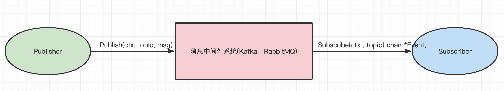
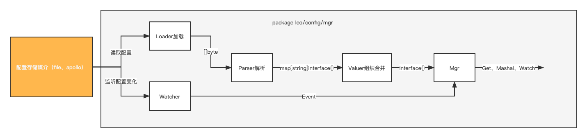

# Leo框架系列（一）leo的启动与HTTP模块分析

# HTTP
Leo现支持HTTP和gRPC两种网络服务，两者可以单独存在也可以同时存在。如果同时存在时，HTTP还可以作为gRPC的代理，实现HTTP请求gRPC服务。


## protoc-gen-go-leo
[protoc-gen-go-leo](https://codeup.aliyun.com/qimao/go-contrib/leo/tree/master/cmd/protoc-gen-go-leo)是一个protoc插件，用来生成xxx_leo.pb.go文件。xxx_leo.pb.go文件让leo是像grpc那样，基于proto定义了HTTP服务。拿例子[example-helloworld](https://codeup.aliyun.com/qimao/go-contrib/leo/tree/master/example/api/helloworld)项目来说：
```proto
syntax = "proto3";
option go_package = "github.com/go-leo/leo/example/api/helloworld;helloworld";
package helloworld;
service Greeter {
  rpc SayHello (HelloRequest) returns (HelloReply) {}
}
message HelloRequest {
  string name = 1;
}
message HelloReply {
  string message = 1;
}
```
生成的helloworld_leo.pb.go：
```go
package helloworld
import (
	client "github.com/go-leo/leo/runner/net/http/client"
	server "github.com/go-leo/leo/runner/net/http/server"
	context "context"
	grpc "google.golang.org/grpc"
	http "net/http"
)
type GreeterHTTPClient interface {
	SayHello(ctx context.Context, in *HelloRequest) (*HelloReply, error)
}
type greeterHTTPClient struct {
	cc client.Interface
}
func NewGreeterHTTPClient(cc client.Interface) GreeterHTTPClient {
	return &greeterHTTPClient{cc}
}
func (c *greeterHTTPClient) SayHello(ctx context.Context, in *HelloRequest) (*HelloReply, error) {
	out := new(HelloReply)
	err := c.cc.Invoke(ctx, http.MethodPost, "/helloworld.Greeter/SayHello", in, out)
	if err != nil {
		return nil, err
	}
	return out, nil
}
func GreeterServiceDesc(srv GreeterServer) func() (any, *grpc.ServiceDesc, *server.ServiceDesc, func(grpc.ClientConnInterface) any) {
	return func() (any, *grpc.ServiceDesc, *server.ServiceDesc, func(grpc.ClientConnInterface) any) {
		return srv, &Greeter_ServiceDesc, &Greeter_HTTP_ServiceDesc, func(cc grpc.ClientConnInterface) any { return NewGreeterClient(cc) }
	}
}
func _Greeter_SayHello_request_constructor() any {
	return new(HelloRequest)
}
func _Greeter_SayHello_HTTP_Handler(cli any, ctx context.Context, in any) (any, error) {
	metadata, _ := server.MetadataFromContext(ctx)
	return cli.(GreeterClient).SayHello(ctx, in.(*HelloRequest), grpc.Header(&metadata.HeaderMD), grpc.Trailer(&metadata.TrailerMD))
}
var Greeter_HTTP_ServiceDesc = server.ServiceDesc{
	ServiceName: "helloworld.Greeter",
	HandlerType: (*GreeterServer)(nil),
	Methods: []*server.MethodDesc{
		{
			HTTPMethod:         http.MethodPost,
			MethodName:         "SayHello",
			Path:               "/helloworld.Greeter/SayHello",
			Handler:            _Greeter_SayHello_HTTP_Handler,
			RequestConstructor: _Greeter_SayHello_request_constructor,
		},
	},
	Metadata: "api/helloworld/helloworld.proto",
}
```
`func GreeterServiceDesc()`函数是关联服务实现对象（比如`srv GreeterServer`）与Leo框架的关键。此函数返回一个闭包函数，这个闭包函数返回四个值：
- 第一个值是服务实现对象，类型是`any`，直接把传入的服务实现对象参数返回（比如`srv GreeterServer`）。
- 第二个值grpc服务描述(比如`Greeter_ServiceDesc`)，这是grpc的protoc插件生成的，leo会用它和服务实现对象注册到grpc server上，这样就可以启动grpc服务了。
- 第三个值是http服务描述(比如`Greeter_HTTP_ServiceDesc`)，这是Leo的protoc插件生成的，Leo会用它和服务实现对象注册到http server上。
- 第四个是一个方法(比如`func(cc grpc.ClientConnInterface) any { return NewGreeterClient(cc) }`)，他将返回grpc客户端，配合http服务描述，http就可以代理grpc了。

下面看看http服务描述`Greeter_HTTP_ServiceDesc`里有哪些信息。
`ServiceName`、`HandlerType`、`Metadata`是proto定义服务的一些信息。
`Methods`包含了所有RPC方法的一些信息：
- `HTTPMethod` Leo里规定，所有RPC方法都是用**POST**请求。
- `MethodName` RPC方法的名字
- `Path` http请求的全路径，由 `"/"+包名+"."+服务名+"/"+方法名` 组成,与gRPC的`FullMethod`相同。
- `Handler` 调用RPC方法的处理函数，比如上面`_Greeter_SayHello_HTTP_Handler`函数，获取header和trailer，将`cli`转成接口`GreeterClient`后，直接调用`SayHello()`方法。
- `RequestConstructor` 请求构造器，在请求来的时候，方便leo可以将从body里读取到的请求数据反序列化到具体的结构体中。

# HTTP Server
[http server](https://codeup.aliyun.com/qimao/go-contrib/leo/tree/master/runner/net/http/server)以[Gin](https://github.com/gin-gonic/gin)为基础库来实现http服务，`Gin`是Go生态中用的最多最广最成熟的HTTP框架，这里就不多介绍了。

```go
type Server struct {
	o         *options
	lis       net.Listener
	httpSrv   http.Server
	healthSrv *health.Server
	startOnce sync.Once
	stopOnce  sync.Once
}
func New(lis net.Listener, opts ...Option) *Server {
	o := new(options)
	o.apply(opts)
	o.init()
	gin.SetMode(gin.ReleaseMode)
	mux := gin.New()
	middlewares := append([]gin.HandlerFunc{header.GinMiddleware()}, o.GinMiddlewares...)
	mux.Use(middlewares...)
	healthSrv := health.NewServer()
	mux.Any(HealthCheckPath, health.HandlerFunc(healthSrv))
	if o.GRPCClient != nil && o.ServiceDesc != nil {
		for _, methodDesc := range o.ServiceDesc.Methods {
			mux.Handle(methodDesc.HTTPMethod, methodDesc.Path, HandlerFunc(o.GRPCClient, o.ServiceDesc, methodDesc))
		}
	}
	for _, router := range o.Routers {
		mux.Handle(router.HTTPMethod, router.Path, router.HandlerFuncs...)
	}
	httpSrv := http.Server{
		Handler:           mux,
		ReadTimeout:       o.ReadTimeout,
		ReadHeaderTimeout: 0,
		WriteTimeout:      o.WriteTimeout,
		IdleTimeout:       o.IdleTimeout,
		MaxHeaderBytes:    o.MaxHeaderBytes,
	}
	srv := &Server{
		o:         o,
		lis:       lis,
		healthSrv: healthSrv,
		httpSrv:   httpSrv,
	}
	return srv
}
```
1. 创建options。
2. 创建`gin`引擎，并设置为`release`模式。
3. 设置全局中间件，在所有全局中间件之前，加一个`header.GinMiddleware()`,他的作用是把`http.Header`放到ctx中。
4. 注册一个匹配所有HTTPMethod的健康检查的路由规则。
5. 如果设置了grpc客户端，并且也有http服务描述，根据http服务描述,每个RPC方法对应的方法描述`methodDesc`，注册到gin上，并用`HandlerFunc`适配http到grpc的转化。
6. 注册自定义路由。
7. 创建http server并返回。

## 创建与启动HTTPServer
```go
func (app *App) startHTTPServer(ctx context.Context) error {
	srv, err := app.newHTTPServer(ctx)
	if err != nil {
		return err
	}
	app.asyncRunner.Run(ctx, srv)
	if app.o.Registrar == nil {
		return nil
	}
	transport := registry.TransportHTTP
	if app.o.HttpOpts.TLSConf != nil {
		transport = registry.TransportHTTPS
	}
	serviceInfo, err := app.newServiceInfo(transport, app.o.HttpOpts.Port)
	if err != nil {
		return err
	}
	app.asyncRunner.Run(ctx, &registrar{Registrar: app.o.Registrar, ServiceInfo: serviceInfo, Logger: app.o.Logger})
	return nil
}

func (app *App) newHTTPServer(ctx context.Context) (*httpserver.Server, error) {
	httpOpts := app.o.HttpOpts
	lis, err := net.Listen("tcp", net.JoinHostPort("", strconv.Itoa(httpOpts.Port)))
	if err != nil {
		return nil, err
	}
	httpOpts.Port = netx.ExtractPort(lis.Addr())

	var grpcCli any
	if app.o.GRPCOpts != nil {
		dialOptions := append([]grpc.DialOption{}, httpOpts.GRPCDialOptions...)
		if app.o.GRPCOpts.TLSConf != nil {
			dialOptions = append(dialOptions, grpc.WithTransportCredentials(credentials.NewTLS(app.o.GRPCOpts.TLSConf)))
		} else {
			dialOptions = append(dialOptions, grpc.WithTransportCredentials(insecure.NewCredentials()))
		}
		conn, err := grpc.DialContext(ctx, net.JoinHostPort("", strconv.Itoa(app.o.GRPCOpts.Port)), dialOptions...)
		if err != nil {
			return nil, err
		}
		grpcCli = app.o.GRPCClientCreator(conn)
	}
	opts := []httpserver.Option{
		httpserver.GRPCClient(grpcCli),
		httpserver.ServiceDescription(app.o.HTTPDesc),
		httpserver.ReadTimeout(httpOpts.ReadTimeout),
		httpserver.WriteTimeout(httpOpts.WriteTimeout),
		httpserver.IdleTimeout(httpOpts.IdleTimeout),
		httpserver.MaxHeaderBytes(httpOpts.MaxHeaderBytes),
		httpserver.TLS(httpOpts.TLSConf),
		httpserver.GinMiddlewares(httpOpts.GinMiddlewares...),
		httpserver.Routers(httpOpts.Routers...),
	}
	srv := httpserver.New(lis, opts...)
	app.o.Logger.Infof("%s server listen at %s", srv.String(), lis.Addr())
	return srv, nil
}
```
1. `app.Run(ctx)`方法会调用`startHTTPServer(ctx, eg)`来启动http服务，`startHTTPServer(ctx, eg)`会调用`newHTTPServer(ctx)`创建http server。
2. `newHTTPServer(ctx, eg)`首先调用`net.Listen()`监听一个tcp端口，如果没有明确指定的端口，那么系统会随机挑一个可用的端口（在服务注册与发现场景使用较多）。
3. 如果已经开启gRPC服务，则需要先创建grpc客户端，用来调用gRPC服务，实现http服务代理gRPC服务。细心的读者发现在`leo.NewApp()`时候，已经把具体服务的对象（比如`srv helloworld.GreeterServer`）传进来了，为什么要通过grpc客户端来调其服务？一个成熟的gRPC项目，可能实现了很多gRPC的中间件，如果用具体的服务对象来调，那这些中间件将不会执行，这些中间件代码，需用`gin`的中间件系统再实现一次，这样开发成本比较高，考虑这个原因，用gRPC客户端来调的话，则简单很多。
4. 由于http server是一种**运行实体**，实现了`runner.Runnable`，所以调用`app.asyncRunner.Run()`启动http server。
5. 如果设置了`Registrar`服务注册器，那么创建一个包含服务信息`registry.ServiceInfo`结构，服务注册器会根据这个服务信息结构，将服务注册到注册中心上。如果程序退出，则会从注册中心注销服务。由于`registry.Registrar`的注册与注销动作都与`runner.Runnable`类似，那么就可以将其包装成`registrar`，这样也可以用`app.asyncRunner.Run()`来启动服务注册功能。

## 转化函数HandlerFunc
```go
func HandlerFunc(cli any, desc *ServiceDesc, methodDesc *MethodDesc) func(c *gin.Context) {
	return func(c *gin.Context) {
		contentCodec := codec.GetCodec(util.GetContentType(c.Request.Header))
		acceptCodec := codec.GetCodec(util.GetAcceptType(c.Request.Header))
		ctx, cancel, err := _GRPCTimeout(c)
		if err != nil {
			errorHandler(c, acceptCodec, err)
			return
		}
		defer cancel()
		ctx, err = newOutgoingContext(ctx, c)
		if err != nil {
			errorHandler(c, acceptCodec, err)
			return
		}
		body, err := io.ReadAll(c.Request.Body)
		if err != nil {
			errorHandler(c, acceptCodec, err)
			return
		}
		in := methodDesc.RequestConstructor()
		if err := contentCodec.Unmarshal(body, in); err != nil {
			errorHandler(c, acceptCodec, err)
			return
		}
		reply, appErr := methodDesc.Handler(cli, ctx, in)
		if appErr != nil {
			errorHandler(c, acceptCodec, appErr)
			return
		}
		data, err := acceptCodec.Marshal(reply)
		if err != nil {
			grpclog.Infof("Marshal error: %v", err)
			errorHandler(c, acceptCodec, err)
			return
		}
		handleHeaderMetadata(c, metadata)
		if requestAcceptsTrailers(c) {
			handleForwardResponseTrailerHeader(c, metadata)
			c.Writer.Header().Set("Transfer-Encoding", "chunked")
		}
		c.Data(http.StatusOK, acceptCodec.ContentType(), data)
		if requestAcceptsTrailers(c) {
			handleTrailerMetadata(c, metadata)
		}
	}
}
```
1. 基于请求头的`Context-Type`和`Accept`，获取对应的解码器`Codec`,默认是json。
2. 取出`"grpc-timeout"`值并创建超时的`context.Context`。
3. 把其他HTTP的header转成gRPC的Metadata。
4. 从请求体里读取数据，通过http服务描述里的`RequestConstructor`字段，构造请求对象（例如`_Greeter_SayHello_request_constructor`），然后用解码器把数据解码到此对象中。
5. 调用handler，此handler就是xxx.leo.pb.go里的xxx_HTTP_Handler，此方法通过gRPC的客户端调用RPC方法,并带上header和trailer。
7. 设置header和trailer，对响应`reply`进行编码，并通过`c.Data()`将响应数据返回给调用者。

## HTTP错误处理errorHandler
如果在转化函数HandlerFunc里出错了，会走错误处理逻辑。
```go
func errorHandler(c *gin.Context, marshaller codec.Codec, err error) {
	s := status.Convert(err)
	pb := s.Proto()
	if s.Code() == codes.Unauthenticated {
		c.Header("WWW-Authenticate", s.Message())
	}
	c.Writer.Header().Del("Trailer")
	c.Writer.Header().Del("Transfer-Encoding")
	buf, e := marshaller.Marshal(pb)
	if e != nil {
		c.JSON(http.StatusInternalServerError, &spb.Status{Code: int32(codes.Internal), Message: "failed to marshal error message"})
		return
	}
	handleHeaderMetadata(c, metadata)
	if requestAcceptsTrailers(c) {
		handleForwardResponseTrailerHeader(c, metadata)
		c.Writer.Header().Set("Transfer-Encoding", "chunked")
	}
	c.Data(HTTPStatusFromGRPCCode(s.Code()), marshaller.ContentType(), buf)
	if requestAcceptsTrailers(c) {
		handleTrailerMetadata(c, metadata)
	}
}
```
1. 将err存入`gin.Context`中，方便gin的中间件处理，比如日志打印等。
2. error转成`grpc.status`，将会还原业务逻辑返回的带有详细grpc错误信息状态。
3. 将`grpc.status`转成googleapi中定义`status.proto`结构。
4. 如果是授权错误，则将错误信息放进"WWW-Authenticate"头里。
5. 去掉多余的`Trailer`头。
6. 设置header和trailer，对错误信息进行编码，并通过`c.Data()`将响应数据返回给调用者。
   
## HTTP启动与停止处理
http server实现`runner.Runnable`,下面分析下它是如何启动与停止的。
```go
func (s *Server) Start(ctx context.Context) error {
	err := errors.New("server already started")
	s.startOnce.Do(func() {
		err = nil
		if s.lis == nil {
			err = errors.New("net listener is nil")
			return
		}
		s.healthSrv.Resume()
		if s.o.TLSConf != nil {
			err = s.httpSrv.Serve(tls.NewListener(s.lis, s.o.TLSConf))
			return
		}
		err = s.httpSrv.Serve(s.lis)
		return
	})
	return err
}
```
* `Server`结构里有一个`startOnce sync.Once`,作用是解决多次并发启动问题，第二次启动会返回错误。
* 启动之前一定要有个`net.Listener`,其监听了一个tcp网络，如果没有，则也会返回错误。
* 初始化健康检查服务的内部状态。
* 如果配了`tls.Config`,将`net.Listener`升级成安全的tcp网络。
* 调用`http.Server.Serve(lis)`,将服务绑定到此tcp网络上，处理`HTTP`请求。

```go
func (s *Server) Stop(ctx context.Context) error {
	err := errors.New("server already stopped")
	s.stopOnce.Do(func() {
		err = nil
		s.healthSrv.Shutdown()
		err = s.httpSrv.Shutdown(ctx)
	})
	return err
}
```
* 统一`Server`里有一个`stopOnce sync.Once`,只能关闭一次。
* 将健康检查的状态设置成下线状态。
* 调用`http.Server.Shutdown(ctx)`,平滑的关闭HTTP服务。


target格式，详细可以参考[gRPC Name Resolution](https://github.com/grpc/grpc/blob/master/doc/naming.md)，其实大体可以理解成这样：
```go
注册中心简称://注册中心地址/服务名?服务元数据
```

# Management
management提供了服务运行时监控检查等功能，比如健康检查，审计，指标收集，跟踪等，帮助我们监控和管理服务。

当前leo内置了如下功能：
* server, http和grpc服务信息与映射
* task, cron和pubsub任务信息
* system, 系统监控
* profile, golang的profile分析
* metric, promethus指标收集接口
* health, grpc与http健康检查
* config, 配置信息
* env, 提供有关os.Environ()环境变量信息。
* shutdown, 正常关闭应用程序
* restart, 重启应用程序
* log, 在运行时动态改变日志级别
* 其他，可以通过Router来扩展

# Task
task分为两类，cron和pubsub
## cron
leo里的cron包装了 [github.com/robfig/cron](https://github.com/robfig/cron) 库，[leo.cron](https://codeup.aliyun.com/qimao/go-contrib/leo/blob/main/v2/task/cron/task.go)比较简单,很好理解, 就不多介绍了
## pubsub
pubsub任务主要是处理`订阅-发布`模式的任务，很容易使用kafka、amqp等等消息中间件。



基于pubsub系统多样性，功能，抽象了以下三个接口：
* Message
* Subscriber
* Publisher
```go
// Message 消息
type Message interface {
	// ID 消息id
	ID() string
	// Header 消息头
	Header() Header
	// SetHeader 设置消息头
	SetHeader(key string, values ...string)
	// Body 消息体
	Body() []byte
	// SetBody 设置消息体
	SetBody(body []byte)
	// Clone 深克隆
	Clone() Message
	// Ack 消息处理成功，确认应答
	Ack() (any, error)
	// Nack 消息处理失败，拒绝
	Nack() (any, error)
}
```
```go
// Event 事件，消息or错误
type Event struct {
	// 消息
	Msg Message
	// 错误
	Err error
}
// Subscriber 订阅者
type Subscriber interface {
	// Subscribe 订阅一个topic，接受的时间会发到返回值chan里
	Subscribe(ctx context.Context, topic string) (<-chan *Event, error)
	// Closer 关闭
	io.Closer
	// Stringer 描述
	fmt.Stringer
}
```
```go
// Publisher 发布者
type Publisher interface {
	// Publish 发布Message到topic上
	Publish(ctx context.Context, topic string, msg Message) (any, error)
	// Closer 关闭
	io.Closer
	// Stringer 描述
	fmt.Stringer
}
```

Task的作用是组织并运行Job
```GO
// Job 
type Job struct {
	// Subscriber 订阅者，不能为nil
	Subscriber   Subscriber
	// Topic 订阅的主题
	Topic        string
	// EventHandler 事件处理函数，不能为nil
	EventHandler func(eventC <-chan *Event)
}
type Task struct {
	// jobs Job列表
	jobs      []*Job
	startOnce sync.Once
	stopOnce  sync.Once
}
func New(jobs []*Job) *Task {
	return &Task{jobs: jobs}
}
func (task *Task) Start(ctx context.Context) error {
	err := errors.New("pubsub task already started")
	task.startOnce.Do(func() {
		err = nil
		// 遍历Jobs列表，并开始订阅
		for _, subscriber := range task.jobs {
			if subscriber.Subscriber == nil {
				err = errors.New("subscriber is nil")
				return
			}
			if subscriber.EventHandler == nil {
				err = errors.New("event handler is nil")
				return
			}
			eventC, e := subscriber.Subscriber.Subscribe(ctx, subscriber.Topic)
			if e != nil {
				err = e
				return
			}
			go subscriber.EventHandler(eventC)
		}
	})
	return err
}
func (task *Task) Stop(ctx context.Context) error {
	err := errors.New("pubsub task already stopped")
	task.stopOnce.Do(func() {
		err = nil
		// 遍历Jobs列表，并停止订阅
		for _, job := range task.jobs {
			e := job.Subscriber.Close()
			if e != nil {
				multierror.Append(err, e)
				continue
			}
		}
	})
	return err
}
func (task *Task) String() string {
	return "pubsub"
}
```
现在leo已经实现了gochan、kafka（基于两种库各实现一套）、redis、amqp。由于代码量略大，不做详细分析。感兴趣的可以看[代码](https://codeup.aliyun.com/qimao/go-contrib/leo/tree/main/v2/task/pubsub)。

# Logger
为了统一多个logger库，leo抽象出一个统一的接口：
```go
// Logger is a interface to log messages.
type Logger interface {
	Leveler
	DebugLogger
	InfoLogger
	WarnLogger
	ErrorLogger
	PanicLogger
	FatalLogger
	CallerSkipable
	FieldAddable
	Cloneable
}
```
`DebugLogger`、`InfoLogger`、`WarnLogger`、``ErrorLogger、`PanicLogger`、`FatalLogger`对应同日志级别，比如`debug`级别
```go
type F struct {
	K string
	V any
}
type Leveler interface {
	// EnableDebug 启用debug级别日志
	EnableDebug()
	// IsDebugEnabled 是否启用debug级别
	IsDebugEnabled() bool
	...
	// Handler 可以使用http动态改变日志级别
	http.Handler
}
type DebugLogger interface {
	// Debug 将参数字符串化后拼接，在以debug级别打印
	Debug(args ...any)
	// Debugf 将参数格式化后，在以debug级别打印
	Debugf(template string, args ...any)
	// DebugF 以Field形式打印
	DebugF(fields ...F)
}
```
`CallerSkipable`是为了调整日志打印时的行码
```go
type CallerSkipable interface {
	SkipCaller(depth int) Logger
}
```
`FieldAddable`可以在打印日志时，添加一些附加信息
```go
type FieldAddable interface {
	// With returns a new Logger with additional fields.
	With(fields ...F) Logger
}
```
`Cloneable`克隆一份`Logger`实例
```go
type Cloneable interface {
	// Clone return new Logger instance.
	Clone() Logger
}
```
leo内置了[zap](https://codeup.aliyun.com/qimao/go-contrib/leo/blob/main/v2/log/zap/logger.go)的实现。

# Config Manager
leo实现了配置的管理。



leo抽象了一下几个接口:
* Loader, 加载器，从某种媒介（文件、数据库、配置中心）加载原始配置数据
* Parser, 解析器，拿到原始配置解析成map[string]any结构
* Watcher, 监听器，监听配置的改变
* Valuer, 值获取器，获取配置的值。

```go
// Loader 加载器
type Loader interface {
	// ContentType 配置内容格式，json、toml。。。
	ContentType() string
	// Load 加载原始配置数据到内存中
	Load() error
	// RawData 获取原始数据
	RawData() []byte
}
```
```go
// Watcher 监听配置变化，并通知变化
type Watcher interface {
	// Watch 开始监听
	Watch() error
	// Events 变化的事件，会发到chan上
	Events() <-chan *Event
	// Stop 停止监听
	Stop() error
}
```
```go
// Parser 解析原始配置数据，并编码到`map[string]any`中
type Parser interface {
	// Parse解析原始配置数据，并编码到`map[string]any`中
	Parse(rawData []byte) error
	// ConfigMap 返回解析的结果
	ConfigMap() map[string]any
	// Support 判断当前解析器是否支持contentType
	Support(contentType string) bool
}
```
```go
// Valuer 值获取器
type Valuer interface {
	// AddConfig add and merge config
	AddConfig(configs ...map[string]any)
	// Config return merged config.
	Config() map[string]any
	// Get can retrieve any value given the key to use.
	Get(key string) (any, error)
	// GetString returns the value associated with the key as a string.
	GetString(key string) (string, error)
	// GetInt64 returns the value associated with the key as an int64.
	GetInt64(key string) (int64, error)
	// GetUint64 returns the value associated with the key as an uint64.
	GetUint64(key string) (uint64, error)
	// GetFloat64 returns the value associated with the key as a float64.
	GetFloat64(key string) (float64, error)
	// GetBool returns the value associated with the key as a bool.
	GetBool(key string) (bool, error)
	// GetTime returns the value associated with the key as time.
	GetTime(key string) (time.Time, error)
	// GetDuration returns the value associated with the key as a duration.
	GetDuration(key string) (time.Duration, error)
	// GetSlice returns the value associated with the key as a slice of interface values.
	GetSlice(key string) ([]any, error)
	// GetStringMap returns the value associated with the key as a map of interfaces.
	GetStringMap(key string) (map[string]any, error)
	// UnmarshalKey takes a single key and unmarshal it into a struct.
	UnmarshalKey(key string, rawVal any) error
	// Unmarshal merged config into a struct.
	Unmarshal(rawVal any) error
}
```
leo针对apollo、nacos和file已经实现了对应的`Loader`和`Watcher`。

内置了`jsonParser`、`tomlParser`和`yamlParser`解析器。

在`Valuer`上，从`gin`获得灵感。我们可能都知道，gin的路由是基于 [字典树/前缀书](https://baike.baidu.com/item/字典树/9825209) 的，在`gin`里进行高效的路由查询。 同样的思想，配置读取上也同样适用。 应用的配置一般都是树形结构（结构体嵌套结构体）。查找里层结构上某个值的时候，必会带上从跟开始的全路径，比如：
 ```go
 type Service struct {
	ID string 
	Name string 
	Metadata map[string]string 
}
type Configuration struct {
	Service Service
}
 ```
找服务ID代码这么写:`conf.Service.ID`，服务名代码会这么写`conf.Service.Name`, 在这种场景下字典树很适合，具体的数据结构算法这里就不展开，有兴趣的可以参考[Trie](https://github.com/derekparker/trie) 。

